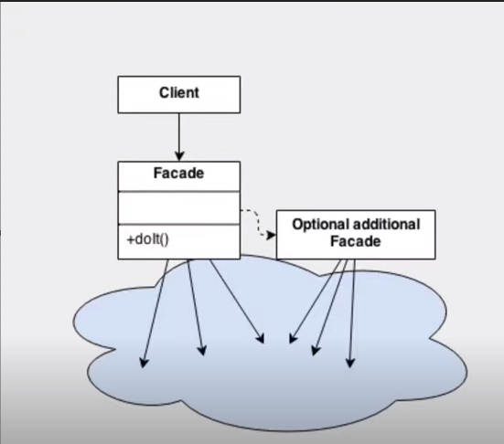
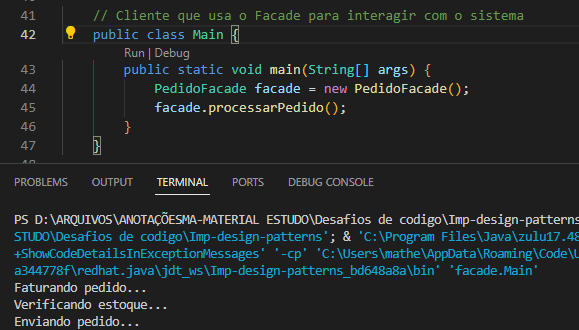

## Padrão Facade

- O padrão de projeto Facade é um padrão estrutural que fornece uma interface unificada para um conjunto de interfaces em um subsistema. Ele define uma interface de nível mais alto que facilita o uso e a interação com o sistema subjacente, ocultando sua complexidade e fornecendo uma interface mais simples e fácil de usar para os clientes.

- Em resumo, o padrão Facade é útil quando você precisa simplificar a interação com um sistema complexo, fornecendo uma interface de nível mais alto que encapsula várias interfaces e operações. Como mostrado no diagrama a seguir:

- Na implementação realizada temos um conceito de subsistemas onde cada um exerce uma função distinta, e temos a classe pedido Facade onde criamos uma "fachada" que se responsabiliza por ser uma interface que interage com os objetos necessários e assim fornecer de uma forma mais limpa as ações que necessitam de vários subsistemas.

