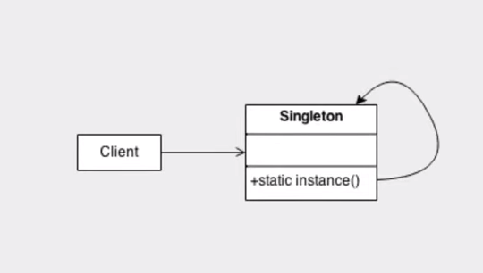
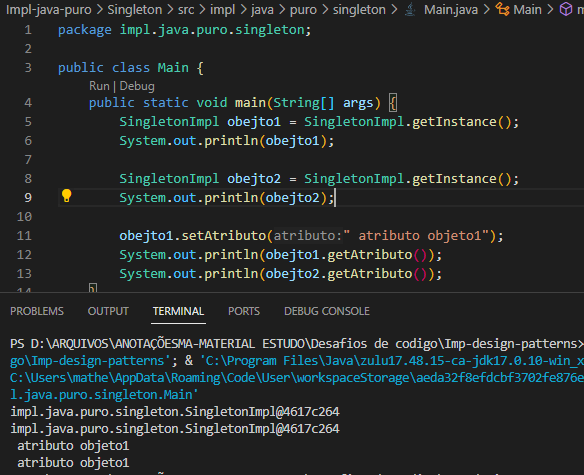

## Padrão Singleton

- Este padrão de projeto se caracteriza por prezar que algumas classes tenham instâncias únicas, assim sempre que for ser utilizada teremos garantia do seu conteúdo, além disso não teremos mais de uma instância ao chamar um objeto. Esse padrão é extremamente necessário para vários casos onde devemos garantir o controle de instâncias de objetos como por exemplo classes de configurações, classes de conexões de bancos de dados, entre outros.

- Para a implementação pura desse padrão de projeto devemos nas classes desejadas tornar os construtores privados e que só serão acionados por um método getInstance, caso a instância já exista ele irá retornar, caso ela não exista o construtor será acionado. Como representado no seguinte diagrama:

- Demonstração do padrao singleton com uma execução de codigo, onde é mostrado que os dois obejtos apontam pra mesma instancia:

