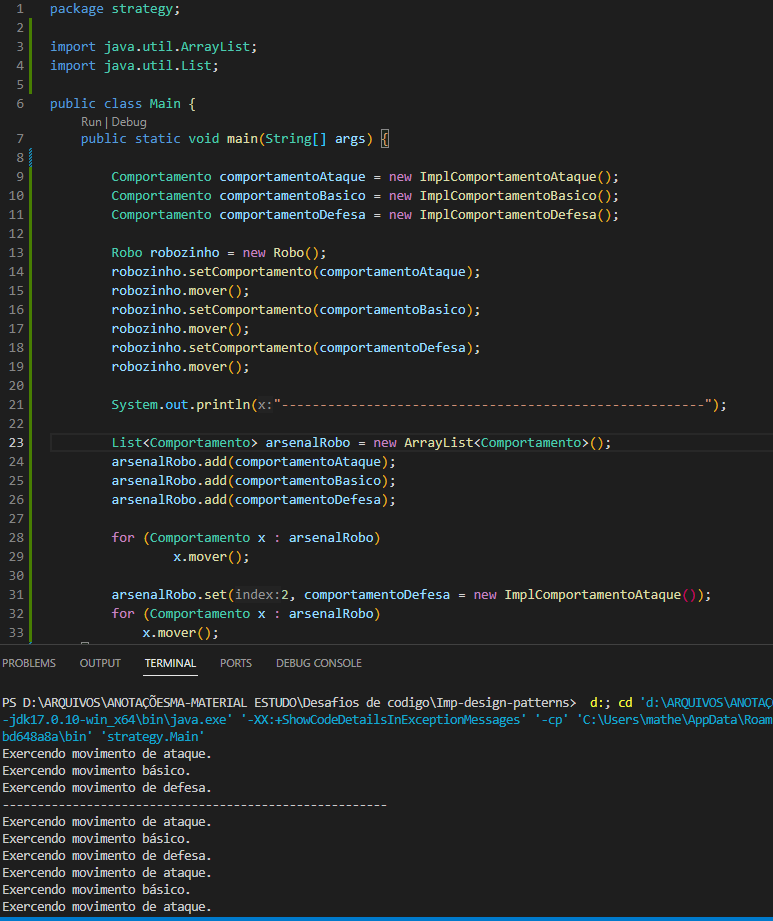

## PADRÃO STRATEGY

- O padrão de projeto Strategy é um padrão comportamental que permite definir uma família de algoritmos, encapsular cada um deles e torná-los intercambiáveis. Ele permite que o algoritmo varie independentemente dos clientes que o utilizam.

- Para a sua implementação criamos uma ou mais interfaces que serão utilizados por várias classes, assim padronizamos o comportamento das classes e garantimos a sua execução. Além disso poderemos alterar o tipo do objeto entre as implementações de forma dinâmica, o seguinte diagrama demonstra o conceito do strategy:

    

- A seguir temos uma execução do código onde demonstramos dois destaques do padrão strategy, sendo eles:
    - Criando um objeto do tipo robô que possui um atributo comportamento podemos alterar esse objeto fazendo mudar o seu tipo entre os diferentes comportamentos, dando assim um comportamento polimórfico através de interfaces e com bastante segurança graças ao contrato que o uso de interface garante, assim, como no exemplos vemos o comportamento do robô mudando utilizando o padrão strategy.

    - Logo após criamos uma coleção para armazenar vários comportamentos diferentes, mas através do polimorfismo e do padrão strategy temos a segurança de que podemos tanto alterar os comportamentos como manipulá los de uma forma mais genérica e com segurança

        