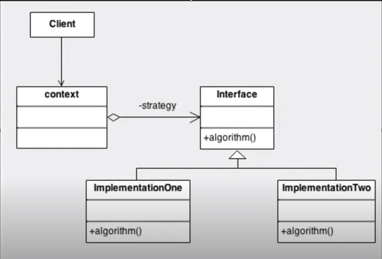

## PADRÃO STRATEGY

- O padrão de projeto Strategy é um padrão comportamental que permite definir uma família de algoritmos, encapsular cada um deles e torná-los intercambiáveis. Ele permite que o algoritmo varie independentemente dos clientes que o utilizam.

- Para a sua implementação criamos uma ou mais interfaces que serão utilizados por várias classes, assim padronizamos o comportamento das classes e garantimos a sua execução. Além disso poderemos alterar o tipo do objeto entre as implementações de forma dinâmica, o seguinte diagrama demonstra o conceito do strategy:

